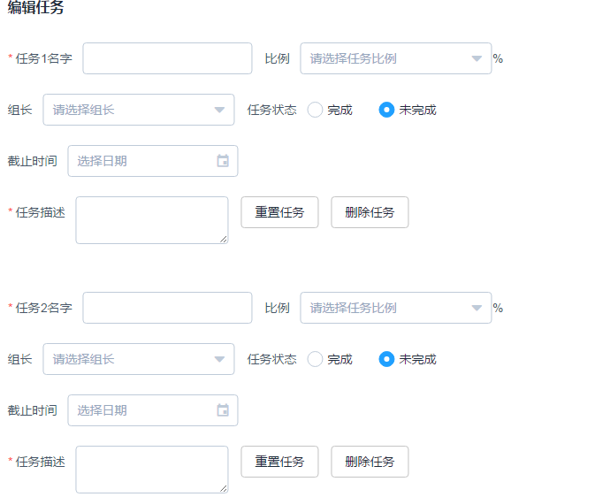
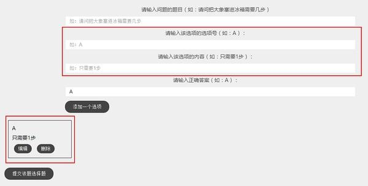

# 动态增加表单项踩雷记录

> 在做task-manage项目的时候涉及到一个功能：动态增加任务分配表单。在尝试了多种解决方案之后决定记录下来

## 方案一  
 最开始提出想法的灵感出自于vue.js搭载的一套后台组件库Elementui给出的官方文档中的[动态增加表单项](http://element.eleme.io/#/zh-CN/component/form#dong-tai-zeng-jian-biao-dan-xiang)部分。   
所谓增加一个表单，就是增加表单中的所有表单项。然后我就傻啦吧唧的用完整的数十个项目全部写了动态增加表单项。如果论可行性，这样做是完全没有问题的。出来的效果如下，代码很容易就不贴了.  
  
显示出来的情况十分令人感动了...

## 方案二
从官方给出的动态增加表单项目的实现原理来看，是将其绑定到了数组中的每个项上，然后通过操作数组来实现，于是想到了将整个表单绑定到一个数组中。
代码如下：  
HTML:  
`
	<el-form
    :inline=true
    ref="c1"
    :rules="rules"
    v-for="(StuForm,index) in StuForms"
    :model="StuForm"
    :key=StuForm.key
    >
	<el-form-item :label="'任务'+(index+1)+'名字'" prop="misname">
        <el-input v-model="StuForm.misname"></el-input>
     </el-form-item>
  </el-form>
`  
JS:  
`	TaskDetail:[{
      misname:"",
      mispeo:"",
      misper:"",
      miscon:"",
      misend:"",
      misdetail:''
    }],
`
实现的效果如下：  
  

表单rules不能直接使用了，因为针对的是object类型，所以在进行表单验证的时候需要js中把表单项作为参数进行传递。此外，表单增加得太多时仍然觉得可读性不强。（通篇的表格看起来好烦=。=）  
## 方法三
参考网上给出的办法后采用了[这篇blog](http://www.jianshu.com/p/73dba151eb29)的第二个方法进行这个方法的重构。在这篇blog中，也给出了两种解决方案，第一种是动态组件原理同我方法二。第二种方法很巧妙，没有动态增加表单项，但是完成了相同的功能。
最后完成的示例如下：  
  
原理是：固定一个表单绑定变量newoption，设置一个数组为options。newoption每增加一个一次将其内容作为数组的一个项append进options中。通过循环在下面显示每个项。需要编辑时，将该项重新渲染回表单中，删除则是单纯的对数组进行的操作。这样，使得代码和界面都变得很简洁。
