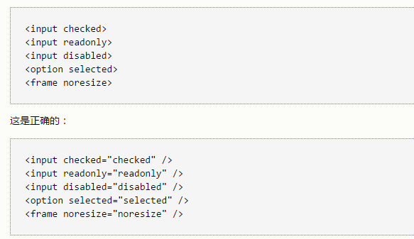

# XHTML简介

> XHTML是更**严谨纯净**的HTML版本（实质:html）  
> XHTML是XML和HTML结合的产物，XHTML包含了XML语法结合HTML 4.01元素。XML 用来描述数据，而 HTML 则用来显示数据。

导览：  

- [XHTML和HTML的最主要的不同](#first)  
    -  [XHTML必须被正确嵌套](#rightNest)

    -  [XHTML元素必须被关闭](#rightClose)

    -  [标签名必须用小写字母](#tagname)

    -  [XHTML文档必须拥有根元素](#rootElement)  

- [更多的 XHTML 语法规则](#second)

    -  [属性的约定](#attribute)  
    
    -  [id属性代替name属性](#idReplace)

    -  [XHTML DTD 定义了强制使用的 HTML 元素](#necessary)
    
-  [XHTML定义了三种文件类型的声明](#third)  
    - [STRICT(严格类型)](#strict)  
    - [TRANSITIONAL（过渡类型）](#transition)  
    - [FRAMESET（框架类型）](#frameset)  
    
-  [XHTML模块化模型定义了XHTML模块](#forth)
   
##  XHTML和HTML的最主要不同

###  正确地嵌套
  

###  XHTML元素必须被关闭
##### 1.非空标签一定要使用结束标签
错误示范:

     
This is a paragraph
正确示范:
 
       
This is a paragraph

##### 2.空标签也必须被关闭
空标签也必须使用结束标签，或者其开始标签必须使用/>结尾。  
错误示范：

        A break:  
        A horizontal rule: 

        An image: 
正确示范：

        A break:  
        A horizontal rule: 

        An image: 
重要的兼容性提示：
你应该在 "/" 符号前添加一个额外的空格，以使你的 XHTML 与当今的浏览器相兼容。

###  标签名必须用小写字母
XHTML 规范定义：标签名和属性对大小写敏感。只能使用**小写字母**。

###  XHTML文档必须拥有根元素rootElement
所有的 XHTML 元素必须被嵌套于 <html> 根元素中。其余所有的元素均可有子元素。子元素必须是成对的且被嵌套在其父元素之中。基本的文档结构如下： 

 

----------

##  XHTML 语法规则      
###  属性的约定
##### 1.属性的名称必须小写
错误示范:  
   
      <table WIDTH="100%">
正确示范:
     
      <table width="100%">
##### 2.属性值必须加引号
错误示范:

     <table width=100%>
正确示范:

    <table width="100%">
##### 3.属性不能简写
错误示范:  
  

下面是一个HTML简写属性列表，以及在XHTML中的改写:

###  id属性代替name属性
> HTML 4.01 针对下列元素定义 name 属性：  
> a, applet, frame, iframe, img, 和map。

在 XHTML 中不鼓励使用 name 属性，应该使用 id 取而代之。  
错误示范:  
  

###  XHTML DTD 定义了强制使用的 HTML 元素
##### 1.语言属性(lang)  
lang属性定义元素内部的内容所使用的语言的类型。在某元素中使用需要添加额外的xml:lang，上代码:

        
HELLO

#####2.强制使XHTML元素
所有的XHTML文档必须进行文件类型声明(DOCTYPE declaration)在 XHTML 文档中必须存在html、head、body元素，而** title** 元素必须位于在 head 元素中。
最小化的XHTML文件模板:

提示:  文件类型声明不是XHTML文档的组成部分，不是其元素，所以没有关闭标签。  

提示:在 XHTML 中，<html> 标签内的 xmlns 属性是必需的。然而，即使当 XHTML 文档中没有这个属性时，w3.org 的验证工具也不会提示错误。这是因为，"xmlns=http://www.w3.org/1999/xhtml" 是一个固定的值，即使你没有把它包含在代码中，这个值也会被添加到 <html> 标签中。

---
## XHTML定义了三种文件类型的声明  
- DTD规定了使用SGML(通用标记语言)的网页的语法  
- 诸如 HTML 这样的通用标记语言应该使用 DTD 来规定应用于某种特定文档中的标签的规则，这些规则包括一系列的元素和实体的声明。  
- 在通用标记语言(SGML)的文档类型声明或 DTD 中，XHTML 被详细地进行了描述。  
- XHTML DTD 使用精确的可被计算机读取的语言来描述合法的 XHTML 标记的语法和句法  

XHTML的三种文档类型分别对应上述DTD
### STRICT（严格类型）

在此情况下使用：需要干净的标记，避免表现上的混乱。请与层叠样式表配合使用。  

### TRANSITIONAL（过渡类型）

在此情况下使用: 当需要利用HTML在表现上面的特性是，并且当需要为那些不支持层叠样式表的浏览器编写 XHTML 时。  

### FRAMESET（框架类型

在此情况下使用：需要使用HTML框架将浏览器窗口分割为两个部分或更多的框架的时候。    

---
## XHTML模块化模型定义了XHTML的模块  
### 1.XHTML模块化的原因  
XHTML 是简单而庞大的语言。XHTML 包含了网站开发者需要的大多数功能。  
对于某些特殊的用途，XHTML 太大且太复杂，而对于其他的用途，它又太简单了。  
通过将 XHTML 分为若干模块，W3C 已经创造出数套小巧且定义良好的**XHTML 元素**，这些元素既可被独立应用于简易设备，又可以与其他 XML 标准并入大型且更复杂的应用程序。

### 2.模块化的优点  
- 选择某种设备所支持的元素  
- 在不打破XHTML标准的情况下，使用XML对XHTML进行扩展  
- 针对小型设备，对XHTNL进行简化  
- 通过添加新的XML功能(MathML,SVG,语音和多媒体)，针对复杂的应用对XHTML进行扩展  
- 定义XHTML框架，比如XHTML BASIC(针对移动设备的XHTML子集)

名词解释:  
MathML:数学标记语言，是一种基于XML（标准通用标记语言的子集）的标准，用来在互联网上书写数学符号和公式的置标语言。  
SVG:意为可缩放矢量图形（Scalable Vector Graphics）

 
