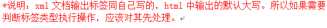
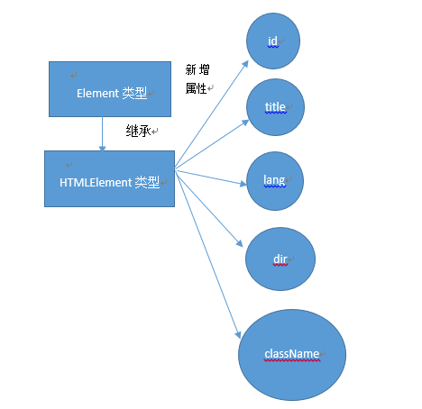

# DOM1（Document类型）

> DOM是针对HTML和XML文档的一个API。DOM描述了一个层次化的结点树，允许开发人员添加，移除和修改页面中的部分。

## Element类型
> Javascript通过Element类型表现XML和HTML元素，提供对**元素标签名**、**子节点**以及**特性**的访问。

### 1.特征

- nodeType的值为1;

- nodeName的值为元素的标签名；

- nodeValue的值为null；

- parentNode可能是Ducument或者是Element;

- 其子节点可能是Element(NodeType=1)，Text(3)，Comment(8)、ProcessingInstruction(7)，CDATASection(4)或者是EntityReference(6)。

### 2.访问元素的标签名
> 有两种方法，可以通过nodeName属性或者是tagName属性   
  
上代码： 
  
      html:
      

      js:
      var div = document.getElementById("mydiv");
      alert(div.tagName); //DIV
      alert(div.nodeName==div.tagName); //true
 
上代码：
   
      //element是获取到的元素      
      if(element.tagName.toLowerCase()=='div'){
          //执行一些操作 
      }   
### 3.HTML元素

id:元素在文档中的**唯一**标识。  
title:元素的附加说明信息，通过工具提示条显示出来。  
lang:(少用)元素内容的语言代码  
dir:(少用)语言的方向，值"ltr"(left-to-right，从左到右)或者"rtl"(right-to-left，从右到左)  
className:与元素的class特性对应。

>问题:为什么不叫class？  
答：class是ECMAScript的保留字.  

可以通过这些html元素扩展属性得到值，上代码:
     
       html:
       

       js:
       var div = document.getElementById("myDiv");
       alert(div.id);
       //myDiv
也可以通过直接的赋值修改:
  
       js:
       div.id="SomeOtherDiv";
直接修改值，不一定立即直观的表示出来。
  

### 4.特性
> 特性的用途是给出相应元素或者其内容的附加信息。

##### a.getAttribute()方法  
接收一个参数，就是特性的名字。可以获取该特性的值。  
特性的名字大小写不敏感。

      var div = document.getElementById('myDiv');
      div.getAttribute('id');  //'myDiv'
      div.getAttribute('class');  //'bd'

        

##### b.setAttribute()方法    
接收两个参数，第一个是特性的名字，第二个是特性改的值。如果特性的值已经存在的话，就覆盖掉旧的值。  
上代码:
    
       var div = document.getElementById("myDiv");
       div.setAttribute("id","SomeOtherid");
       div.setAttribute("data-myattribute","special");
设置的特性，**默认**转为小写形式。
#### c.removeAttribute()方法
接收一个参数，可以将特性和它的值一起删掉

### 5.attribute属性（少用，Element唯一一个DOM节点实现）
其值为一个动态的对象NameNodeMap，保存每个节点。其中每个结点都有每个人的基本信息都在这里。  
方法:  
- 
- getNamedItem(name) //返回nodeName属性的name的点  
- removeNameItem(name) //可以从列表中移除节点和节点的搭配  
- setNamedItem(name) //列表中添加节点，节点的nodename为例子  
- item(pos)
     