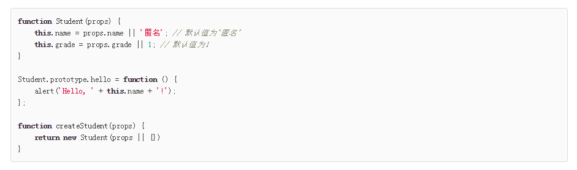
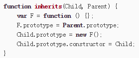

# JS对象

> 对象可以定义自己的方法，但是一些简单的数据类型，比如字符串和数组都有自己的方法，但它们又是不可变的。这就引入了原型链的概念

## 创建对象
### 直接定义：
>{...}直接定义

eg.`var flight={airline:"Oceanic",num:815,departure:
{IATA:"SRD",time:"2018-3-12"}}`
### 通过函数创建
  

## 关于原型链
正如文章开篇提到的一个问题就是一个简单类型的数据也能有自己的方法，其实这就是因为原型链。用一个最简单直接的图说明问题。
  
当尝试获取某个对象的属性值该对象没有时，就会上溯到原型链上寻求解

## 原型继承
原型继承实质上是继承实际上是类型的扩展。但是，JavaScript由于采用原型继承，我们无法直接扩展一个Class，因为根本不存在Class这种类型。
但是通过构造函数也能完成该功能。
参考[原型继承-廖雪峰](https://www.liaoxuefeng.com/wiki/001434446689867b27157e896e74d51a89c25cc8b43bdb3000/0014344997013405abfb7f0e1904a04ba6898a384b1e925000)
实际上是通过构造了一个空函数将原型链经过“重整”。
最好是通过innherit()方法将函数“黑盒化”。

## class继承-ES6新标准
