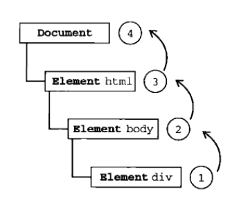
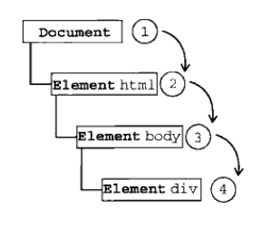
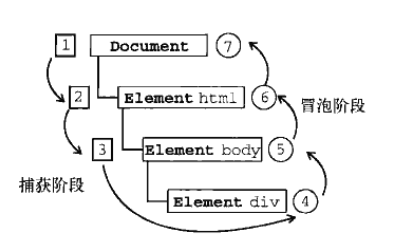

# 事件

> javascript和HTML的交互就是通过**事件**进行实现的。  
> 事件的定义：文档或者浏览器窗口中发生的一些特定的交互瞬间，可以使用侦听器（处理程序）预定，以便发生的时候能过执行代码。

导览：  

- #### [事件流](#eventFlow)    
 - [事件冒泡](#bubble)   
 - [事件捕获](#capture)
 - [DOM事件流](#domEventFlow)  
 
- ####[事件处理程序](#eventDeal) 
    -  [HTML事件处理程序](#htmlEventDeal)
    -  [DOM0级事件处理程序](#zeroEventDeal)
    -  [DOM2级事件处理程序](#twoEventDeal)  
    -  [IE事件处理程序](#ieEventDeal)
    -  [跨浏览器的事件处理程序](#comprehensive)  
    
## 事件流    
> 事件流：从页面接收事件的顺序。  
> 浏览器有两种处理事件流的方式:事件冒泡和事件捕获。  

下面的示例来进行对比:    
 
 
       <!DOCTYPE html>
       <html>
       <head>
          <title>Event flow</title>
       </head>
       <body>
          
Click me

       </body>
       </html>

### 事件冒泡  （推荐使用）
> 事件冒泡：事件开始由最具体的元素（文档中嵌套层次最深的那个节点开始）接收，然后逐步的向上传播到最不具体的节点(document)。  

点击<div\>元素,click事件的传播顺序如下:  
(1) <div\>  
(2) <body\>   
(3) <html\>  
(4) document 

 

简而言之，就是click事件沿着DOM树向上传播，在每一级节点上都会发生，直到document对象。  
  
说明:所有浏览器都支持事件冒泡，但是具体的实现之间有差异。  IE5.5之前跳过<html\>元素。IE9,Firefox,Chorme和Safiri则将事件冒泡到window对象。

### 事件捕获
> 跟事件冒泡的顺序恰好相反。其思想是：不太具体的节点更早接收到事件，具体的节点最后接收到事件。用意就在于：可以在事件到达预定目标之前就捕获它。

点击<div\>元素,click事件的传播顺序如下:  
(1) document  
(2) <html\>   
(3) <body\>  
(4) <div\>   
 
 
简而言之，就是click事件沿着DOM树一次向下传播到实际目标<div\>元素。   
说明:Netscape Communication浏览器只支持事件捕获方式。  
但IE9,Safari,Chorme,Opera和Firefox都支持。  
但是浏览器的实际实现中，都是从window对象开始捕获事件。  

### DOM事件流   
"DOM2级事件"规定事件流的三个阶段：
###### 1.事件捕获阶段  
为截获事件提供了机会。
###### 2.处于目标阶段   
实际收到目标接收的事件。
###### 3.事件冒泡阶段  
在这个阶段对事件做出响应。  
  
示例如下：  
   
分析：
捕获阶段：从Document到<html\>再到<body\>就停止了  
处于目标阶段:事件在<div\>上发生  
事件冒泡阶段:事件处理，然后事件传播回文档。  
说明:IE9,Safari,Chrome,Firefox和Opera9.5中，在捕获阶段触发事件对象上的事件。结果就是由两个机会在目标对象上进行操作。  

## 事件处理程序       
> 响应某个事件的函数就叫做事件处理程序(或事件侦听器)。  
> 事件处理程序以"on"开头，因此click事件的处理就是onclick，load事件的事件处理程序就是onload。
  
### HTML事件处理程序    
某个元素支持某种事件，可以用相应事件处理程序同名的HTML特性来指定。  
示例：    

     <input type="button" value="Clickme" onclick="alert('Clicked')" />  

注意：onclick特性的值是js代码，因此不能在其中带有未转义的HTML语法字符-如&，<,>,""等。  
js代码也可以单独定义：  

      
      <input type="button" value="clickme" onclick="showMessage()" />
  
这个动态创建的函数，可以扩展它的作用域。在这个函数的内部，可以像访问局部变量一样访问document及本身的成员，这个函数使用with的嵌套可以扩展作用域，可以用在表单中：
  
           
所以可以如下直接如下使用：
  
       <form method="post">  
          <input type="text" name="username" value="" />
          <input type="button" value="Echo Username" onclick="alert(username.value)"  />
       </form> 
直接引用了username元素。

##### 缺点   
1.时差问题： 用户可能在HTML元素一出现在页面上就开始点击，然后程序的执行环境还没有准备好。  
    
      <input type="button" value="click me" onclick="try{showMessage()}catch(ex){}" />
2.扩展事件处理程序的作用域链在不同的作用域链在不同浏览器中导致不同的结果。访问非限定对象出错。  
3.html代码和JS代码紧密耦合。

### DOM0级事件处理程序  
> 将一个函数值赋给一个事件处理程序。   
上代码:

         var button = document.getElementById("myBtn");
         btn.onclick = function(){
            alert(this.id);  //myBtn    
         }
         //在元素的作用域中运行，在冒泡阶段被处理  
         //删除时间处理程序  
         btn.onclick = null

优点:简单，跨浏览器的优势  
缺点:不能添加多个事件处理程序  
   
### DOM2级事件处理程序 
> 两个方法：addEventListener()和removeEventListener()  
> 都接收三个参数：1.处理的事件名 2.事件处理程序的函数 3.bool值：true表示在捕获阶段调用，false表示在冒泡阶段调用。  
 
##### addEventListener()  
       var btn = document.getElementById("myBtn");
       btn.addEventListener("click",function(){
                                     alert(this.id)
                                    },false);
       btn.addEventListener("click",function(){
                                 
                            },false);
##### removeEventListener()  

### IE事件处理程序  
### 跨浏览器的事件处理程序 
