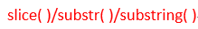

# 引用类型（三）

> 对象是引用类型的实例。新的对象通过new操作符来进行构造的。

## Function类型
### 没有重载(JS的特性)
同名函数，在js中将会出现覆盖问题。最近一次生命的将会把前面的覆盖掉。

### 函数声明与函数表达式
函数声明：

       function sum(num1,num2){
          return num1+num2;
      }
函数表达式:

     var sum = function (num1,num2){
         return num1+num2;
     }
看上去没什么区别嘛...但函数声明有一个提升，所谓函数声明提升就是在解析代码的时候，不论函数声明处于什么位置，它都会出现在代码树的顶部。
举个例子就懂了。     
       
         alert(sum(10,10));
         function sum(num1,num2)...; //正常执行输出20
         alert(sum(10,10));
         var sum = function(num1，num2)... //报错 
    

### 作为值的函数
函数表达式中，函数名本身也是变量。所以，函数可以作为值来使用，即可以是函数的参数，也可以是函数的返回值。

### 函数的内部属性
#### arguements
arguements是一个类数组的对象，它的主要作用就是保存函数的参数。但它还有一个参数就是callee的属性，该属性是一个指针，指向拥有这个arguements对象的函数，它的作用就是在写递归函数的时候去取代函数名，避免出现改名之后的迭代错误。上代码:

         function factorial(num){
              if(num <=1){
                return 1;   
             }
              else{
               return num*arguements.callee(num-1);
          }
        }
        //如果写为 return num* factorial(num)以下的调用将会出错
        var trueFactorial = factorial;
        factorial = function (){
            return 0;
        }
        alert(trueFactorial(5));   //是arguments.callee写的正确输出120，否则将会出错
        alert(factorial());        //0

#### this
this引用的是函数执行时的环境对象。

#### caller属性
caller属性保存着当前函数的函数的引用，但如果在全局作用域中调用当前函数，那么输出的是null。上代码就知道了：

       function outer(){
         inner();
      }
      function inner(){
         alert(arguments.callee.caller); 
      }
      outer();  //在警告框中显示outer()函数的代码

### 函数的属性与方法
#### 属性-length
表示函数希望接受的参数命名的个数。
#### prototype属性
对于引用类型而言，prototype属性就是所有实例方法的真正所在。prototype属性不可枚举。详细关于它的思考，在对象的分类中。

#### apply()方法/call()方法
作用：在特定的域中调用函数，实际是对this对象的值。对于apply()方法，它接收两个参数：一个是运行函数的作用域，另一个是参数数组（可以是arguements对象）。
对于call()方法，第一个参数是运行函数的作用域，后面紧跟所有参数，以逗号分开。   
上代码：

                    function sum(num1,num2){
                        return num1+num2;
                    }
                    function applySum(num1,num2){
                       return sum.apply(this,[num1,num2]);
                       //等价
                       return sum.apply(this,arguments) ;
                    }
                    function callSum(num1,num2){
                       return sum.call(this，num1,num2); 
                    }
延伸--bind(),接收一个需要被绑定的this的值。它工作原理是创建一个函数的是，其this的值就会绑定到传给bind()函数的值。
   
     window.color ='red';
     var o ={"color":"blue"};
     function sayColor(){
        alert(this.color);     
    }           
    var objectSaycolor = sayColor.bind(o); 
    onjectSaycolor();      //输出的是blue

## 基本包装类型
ECMAscript提供了三个特别的引用类型:Boolean,String,Number。这很好的解释了为什么基本类型之有方法：每当读取一个基本类型的值的时候，后台就会对它创建一个基本包装类型的对象，使得可以调用其方法来操纵数据。
### 对比引用类型与基本包装类型
其最主要的区别就是对象的生存周期。使用new创建的引用类型的实例，是在执行流离开当前作用域之前都保存在内存中。而自动创建的基本包装类型的对象，则只存在于**代码执行的瞬间**,然后立即被销毁。这意味着，不能再运行时为基本类型值添加属性和方法。
### Boolean类型
建议永远不要使用Boolean对象。
### Number类型
1.valueOf(),toString()  
它重写了valueOf(),toLocalString(),toString()方法。valueOf()方法返回对象表示的基本类型的数值，而另外两个方法将返回字符串形式的数值。**tostring()方法接收参数，表示可以返回不同进制的字符串形式。**
2.fixed()
接收参数x，将数值格式化保留x位小数。eg.
 
    var num =10;
    alert(num.fixed(2));  //警告框显示10.00；

3.toExponential（）
接收参数，将数值格式化为10的几次幂的表示方法。
4.toPrecision()方法
接收参数x，根据保留小数位数x的大小，自动判断用e的科学计数法还是直接四舍五入进行数字的保留。

### *String*
1.valueOf(),toString(),toLocalString()方法，都返回字符串本身。  
2.length属性，可以读取字符串的长度  
  
#### 字符方法
charAt()和charCodeAt()
接收一个整数，基于0字符的位置。返回该位置的内容/该位置编码后的内容。
可以对字符串使用方括号加索引来访问该位置的值。

#### ***字符串方法***
1.concat()方法  
可以讲字符串拼接起来,用的不多因为用'+'更容易的啊。  
2.创建新字符串的方法  

这三个方法都接收两个参数。第一个参数是截取新的字符串的开始位置，第二个参数(可以不指定)是表示字符串的结束。slice(）和substring( )时子字符串的最后一个位置的后一个位置，substr()是指子串的长度。如果不指定，默认截取到字符串的最后。  
上代码：
  
        