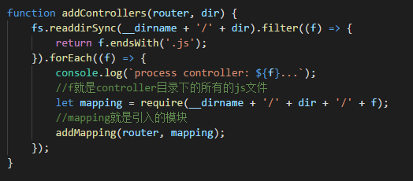

# 引用类型(一)

> 对象是引用类型的实例。新的对象通过new操作符来进行构造的。

## Object类型

是最常见的类型。

## Array类型
### 检测array
虽然可以通过方法 `value instanceof Array`得到结果，但是这个语句是有条件的。即：网页中只有一个框架，于是另外一种方法应运而生。
可以通过`Array.isArray(value)`来确定，它将返回一个Boolean类型的值。

### 转换方法
数组继承的toString(),toLocalString()和ValueOf()方法，默认将以都哈分割的形式返回数组项。如果使用join方法，则有

    var colors = ["red","blue"];
    alert(colors.join(","));  //red,blue
    alert(colors.join("||")); //red||blue
    alert(colors.join());   //red,blue

### 栈方法和队列方法
####栈
> 栈是一种LIFO(后进先出)的数据结构。

ECMAScript为数组提供相应的**push( )**和**pop( )**方法。都直接作用于数组，改变数组本身。
其中，push()的返回值为数组的长度。pop()的返回值为出栈的元素

    var colors = new Array();
    var count = colors.push("red","green");  //count值为2
    var item = colors.pop()  //item的值为：green
####队列

>对应的，队列数据结构访问的规则为FIFO(先进先出)。

所以对应的方法为：**shift()**和**push()**。shift（）也直接作用于数组中，将数组的“头” 的元素取出来，其返回值就是出队列的元素。

    var colors = new Array();
    var count = colors.push("red","green"); //count值为2
    var item = colors.shift();  //item的值为"red"

对应的，如果模拟“反队列”，则是从头插入元素，从尾取出元素。对应的方法为：**unshift()**和**pop（）**。其中unshift（）执行的操作就是shift()的逆操作：从头插入元素。其返回值为数组的长度。

    var colors = new Array();
    var count = colors.push("red","green"); //count值为2
    count = colors.unshift("white"); //count值为3，colors=["white","red","green"];
### 重排序方法
#### reverse（）
reverse()方法就单纯的将数组进行翻转,翻转后直接作用于原数组。原数组改变。

    var values =[1,2,3,4,5];
    values.reverse();     //values=[5,4,3,2,1]
#### ***sort ( )***
> 排序原理：sort（ ）方法调用每个数组项的toString()方法，然后比较得到的字符串，确定如何排序。这样子的优点是可以对字符串排序，而缺点是可能会出现与我们预期不符合的情况。
>
    var values = [0,1,5,10,15];
    values.sort(); //values =[0,1,10,15,5]

 >5 > 15 吗？？？

所以sort（）方法可以接受一个_比较函数_作为参数.这个比较函数接收两个参数。如果按照升序排列，第一个参数 > 第二个参数时就返回一个正数。反之，返回负数。废话少说，上代码。

    function compare(value1,value2){
       if(value1<value2){
          return -1;
         }
       else if(value1>value2){
         return 1;
        }
       else{
          return 0;
       }
    }
可简写为

    function compare(value1,value2){
       return value1-value2;
    }

调用：

     var values =[0,1,5,10,15];
     values.sort(compare);  //values=[0,1,5,10,15]

> 延伸 ：前几天写代码遇到一个对一个全是对象的数组，按照某一个属性进行排序。传参的时候直接将属性值传进去了，这样，灵活性变得很差，想让它实现将属性名作为参数的排序函数，综合**函数返回函数**的思想，进行重写如下：
    
    function createComparisonFunction(propertyName){
       return function(object1,object2){
          var value1 = object1.propertyName;
          var value2 = object2.propertyName;
          return value1 - value2;
      }
    }
         //测试
    var data =[{name:"Zachary",age:28},{name:"Nicholas",age:9}];

    data.sort(createComparisonFunction("name"));

    //data的值为:[{name:"Nicholas",age:9},{name:"Zachary",age:28}]

### 操作方法
#### concat()
这个方法不影响原数组，它创建原数组的副本，然后有可选参数（一个或多个数组）可以作为元素添加到新的数组中。

    var colors = ["red","green"];
    var colors2 = colors.concat("yellow",[“black”,"brown"]); 

    //colors2的值为["red","green","yellow",“black”,"brown"]
#### slice()
这个方法不影响原数组。接收一个或两个参数，第一个参数表示返回项的起始位置（含），第二个参数表示返回项的截止位置(不含)。如果只有一个参数，默认从指定位置到整个数组的所有项。
 
    var num = [1,2,3,4,5];
    var num1 = num.slice(1); //num1的值为[2, 3, 4, 5]
    var num2 = num.slice(1,4); //num2 的值为[2,3,4]
#### ***splice()***
这个方法**直接作用于原数组**。其返回值为删除的元素组成的新的数组。
有三种功能。

1.删除    
指定两个参数。第一个参数表示开始位置，第二个参数表示删除的项数。

2.插入  
指定3个参数。第一个参数：开始的位置。第二个参数：0（删除的项数），第三个参数（可扩展）是要新插入的项。

3.替换  
指定4个3个参数。第一个参数：开始的位置。第二个参数：删除的项数，第三个位置，插入的新的项（可扩展）  
仍然是上代码：

    var num = [1,2,3];
    var removed = num.splice(0,1);
    //num的值为:[2,3],removed =[1]

    removed = num.splice(1,0,4,5);
    //num的值为[2,4,5,3],removed的值为[]

    removed = num.splice(1,1,6,7);
    //num的值为[2,6,7,5,3],removed的值为[4]

### 迭代方法
#### every( ) / some( )
对数组每一项运行给定函数，其参数为item，index，array（可选）  
every()：如果每一项都返回true，则返回true。
some():存在一项返回true就返回true。  
上代码:
    
    var nums = [1,2,3,4,5,4,3,2,1];
    var everyResult = nums.every(functio(item,index,array){
         return(item>2);
    });  
    //everyResult的结果为false
    

    var someResult = nums.some(function(item){
           return (item>2);
    });    
    //someResult的结果为true
#### map/filter
可以参考[廖雪峰老师的js教程](https://www.liaoxuefeng.com/wiki/001434446689867b27157e896e74d51a89c25cc8b43bdb3000/0014351219769203e3fbe1ed611475db3d439393add8997000)

### forEach()
> 对数组的每一项都执行该操作，但是没有返回值  

上个实例，就是在写node的时候对遍历的对象进行路由的注册。

   

### 归并方法
#### reduce()   
仍然参考上述教程

#### reduceRight()
是reduce()的反向。reduce从数组的第一项开始向后进行迭代，reduceRight()是从数组的最后一项开始向前开始迭代。  
仍旧上个代码就跑了：
    
      var values = [1,2,3,4,5];
      var sum = values.reduce(fuction(prev,cur,index,array){
          return prev+ cur;
     });  
     //sum 结果为15，执行的是1+2+3+4+5  
     
     var sum = valus.reduceRight(fuction(prev,cur,index,array){
          return prev+ cur;
     }); 
     //sum 结果为15，执行的是5+4+3+2+1

     